# LAST WINDOW · Moon ascent

<p align="center">
  <a href="https://farikonsec.github.io/last-window/">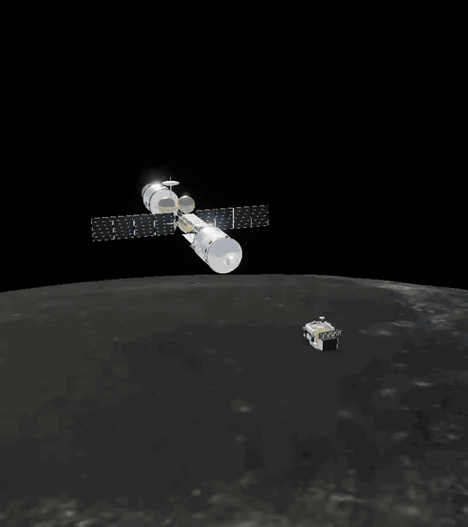</a>
</p>

<p align="center"><b><a href="https://farikonsec.github.io/last-window/">▶ Play in your browser</a></b> · desktop, iPhone and Android · no install</p>

You have one launch window. Lift the KESTREL ascent stage off the Moon near Apollo 15's landing site at Hadley, fly a manual ascent into a 100 km orbit, catch the mothership ARGO and dock by hand. Then land again, and drive a buggy to any real spacecraft on the Moon — near side or far side.

It runs entirely in the browser (WebGL, no backend). A desktop browser with a GPU works best; phones work too.

## Docking, by hand

<p align="center">
  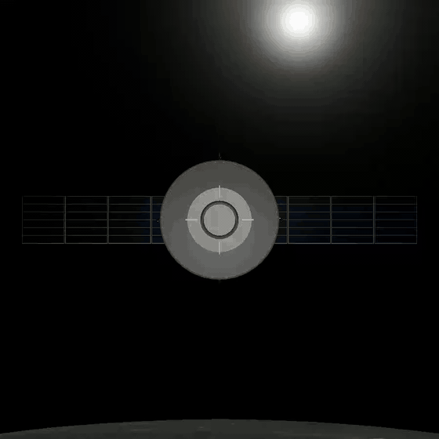
  
</p>
<p align="center"><sub>Left: the docking sight on final approach. Right: the same approach from outside, KESTREL closing on ARGO above the sunlit Moon.</sub></p>

Relative motion near another orbit is not intuitive — burn toward the target and you drift past it. The HUD works in the LVLH frame and predicts the drift with the Clohessy–Wiltshire equations. Match velocity, line up on the port axis, and close under about 0.2 m/s.

## Launch and drive

<p align="center">
  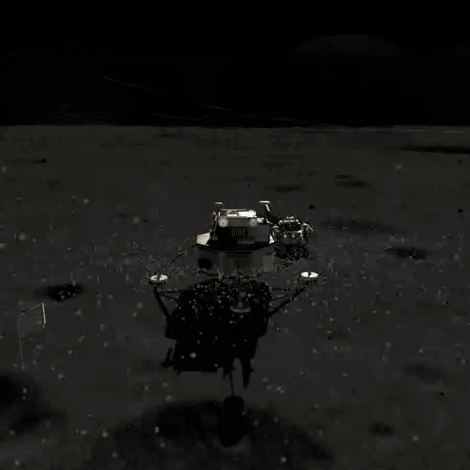
  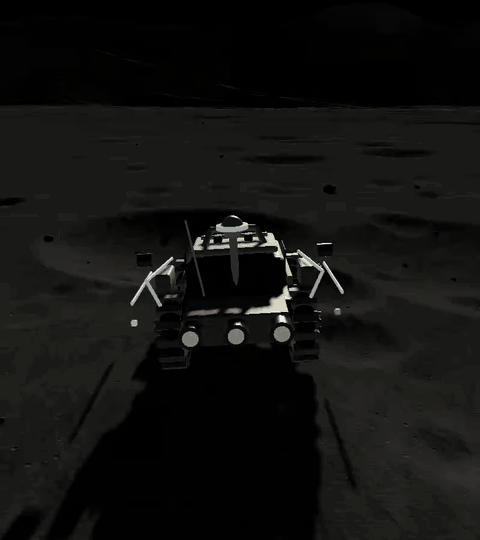
</p>
<p align="center"><sub>Left: liftoff and the gravity turn. Right: the buggy at speed across the plain.</sub></p>

<table>
  <tr>
    <td width="33%">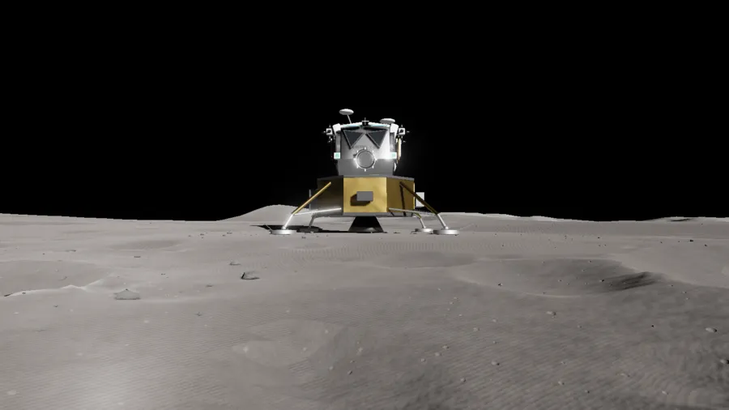<br><sub>On the pad at Hadley, waiting for the window</sub></td>
    <td width="33%">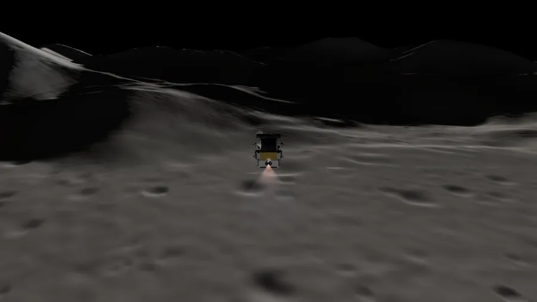<br><sub>Gravity turn: trading climb for orbital speed</sub></td>
    <td width="33%">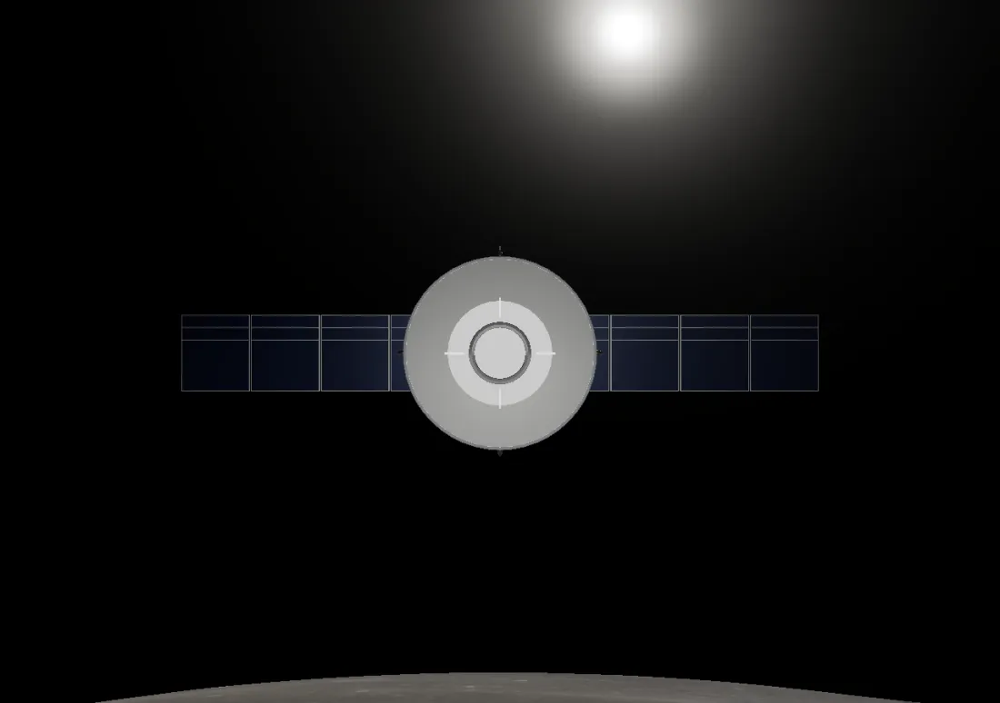<br><sub>ARGO's port in the docking sight</sub></td>
  </tr>
  <tr>
    <td>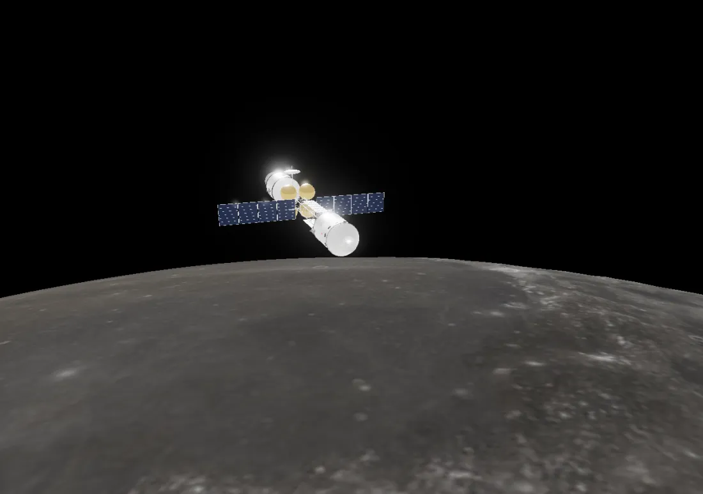<br><sub>ARGO in its 100 km orbit</sub></td>
    <td>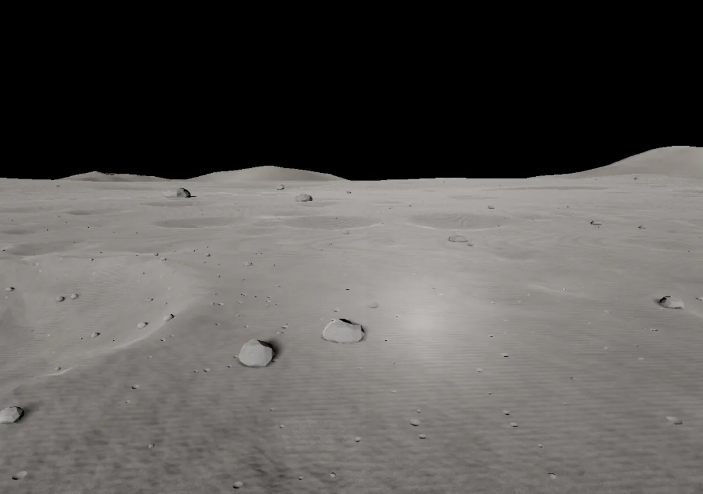<br><sub>Hadley Rille, from SLDEM2015 elevation data</sub></td>
    <td>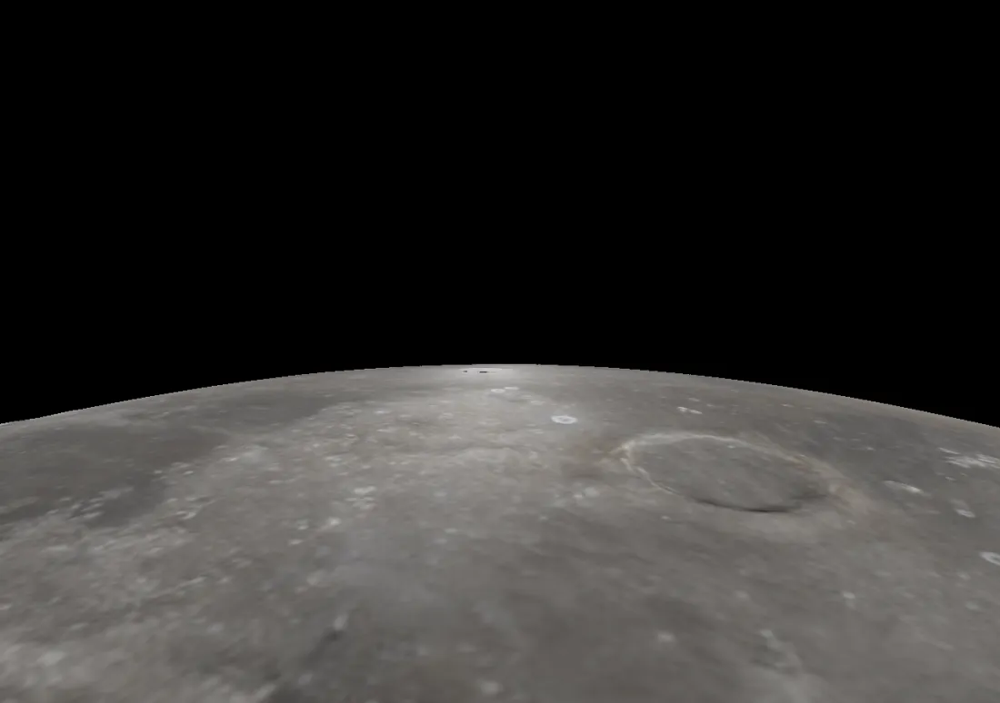<br><sub>100 km up, raking light on the Apennines</sub></td>
  </tr>
  <tr>
    <td>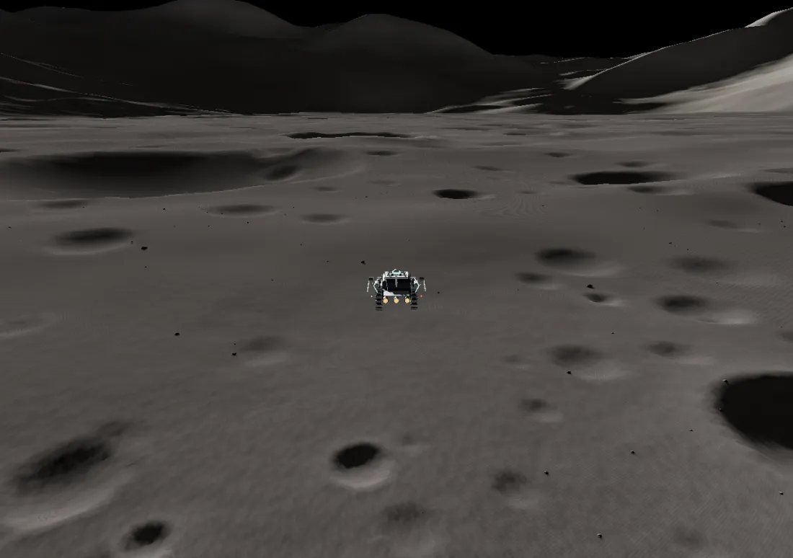<br><sub>The crew buggy on the Hadley plain</sub></td>
    <td>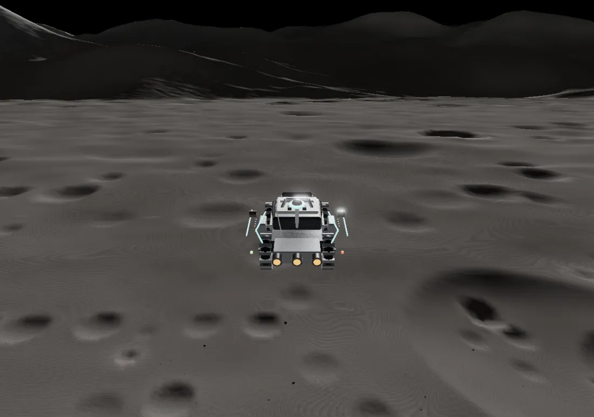<br><sub>Airborne: the buggy flies on vacuum thrusters</sub></td>
    <td>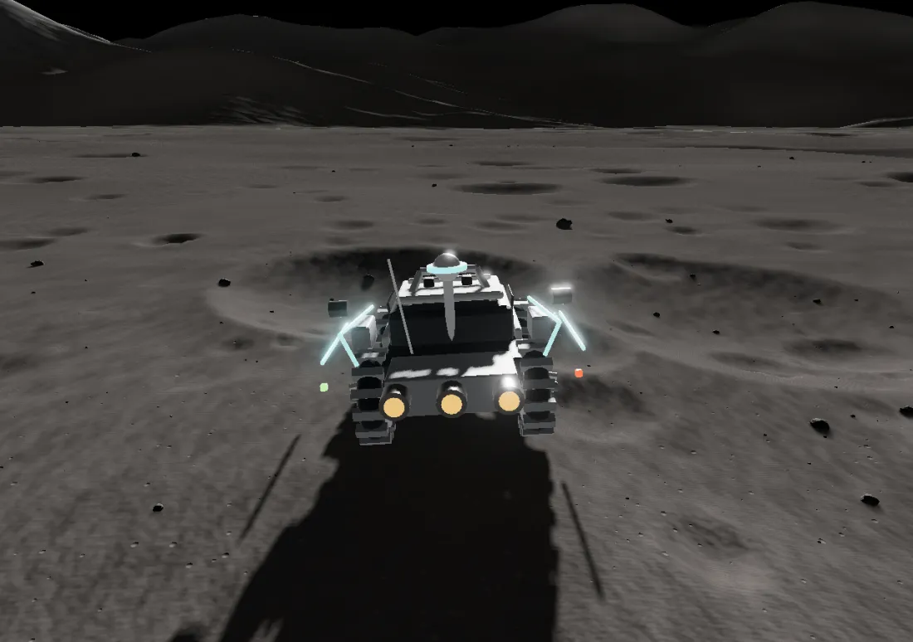<br><sub>Whole-Moon map: every mission, and your target</sub></td>
  </tr>
</table>

## Drive to any mission on the Moon

Pick any real spacecraft as a target. An on-screen arrow gives the bearing and the distance left, the map draws a line to it, and you can drive there yourself, let **AUTO** fly you across the Moon, or jump straight there with **GO**. Each site has its own model, sized from published figures and carrying its country's flag.

<table>
  <tr>
    <td width="25%">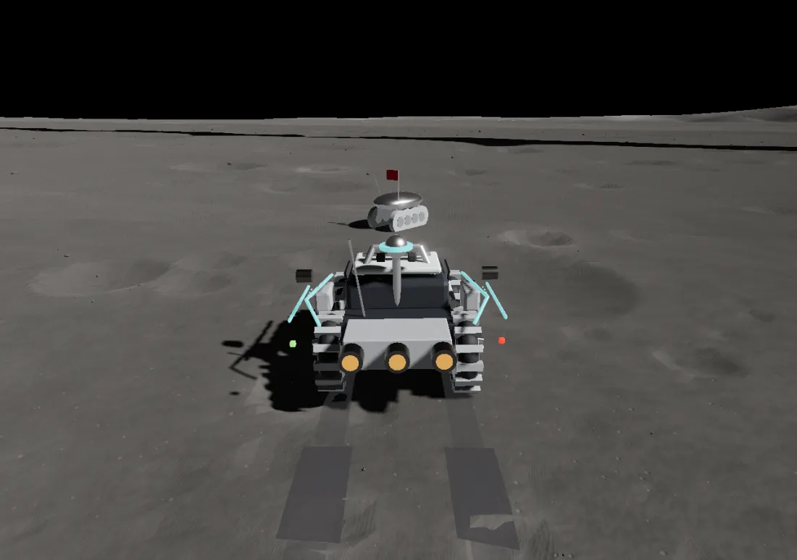<br><sub>Lunokhod 2 · USSR · 1973</sub></td>
    <td width="25%">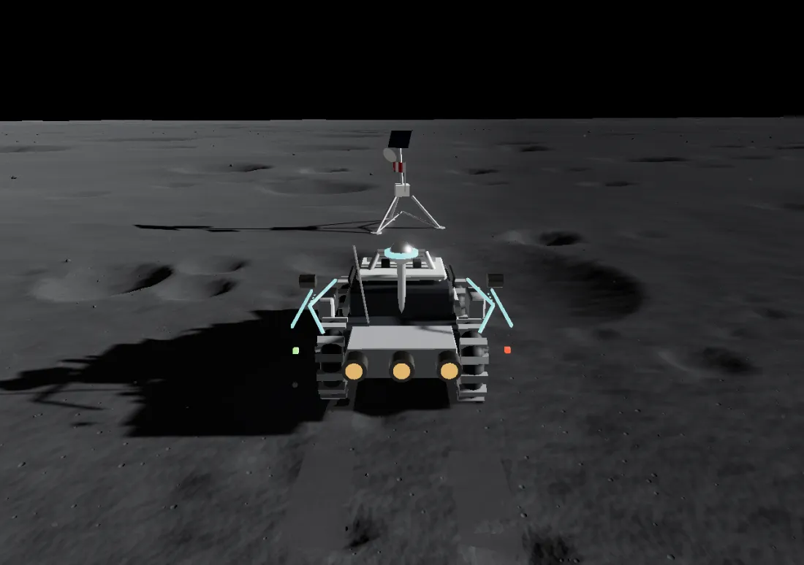<br><sub>Surveyor 1 · NASA · 1966</sub></td>
    <td width="25%">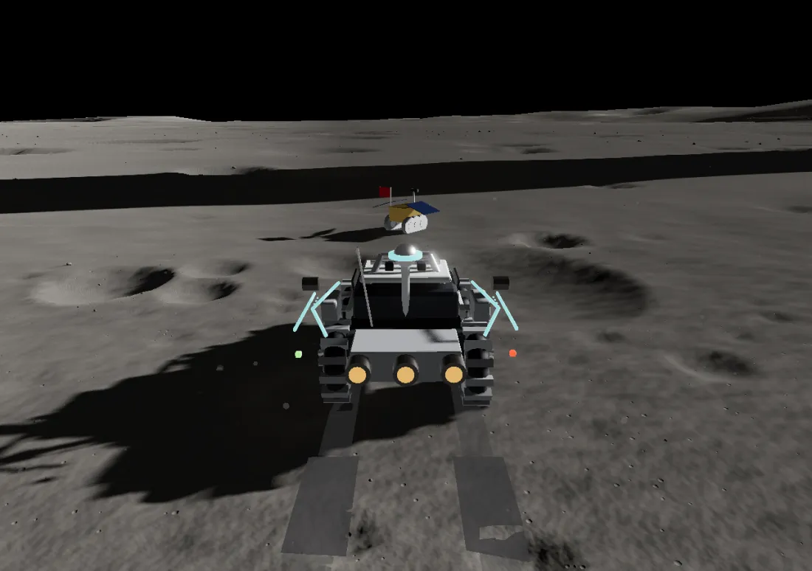<br><sub>Yutu-2 · CNSA · far side</sub></td>
    <td width="25%">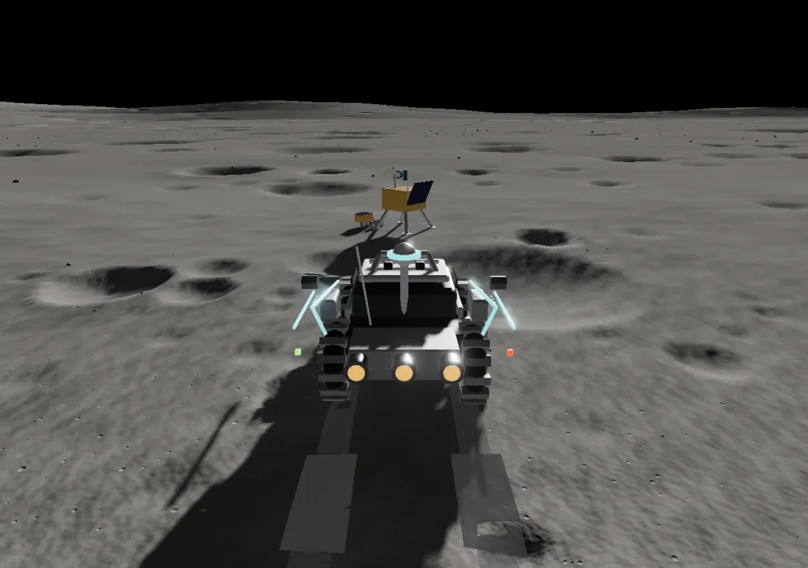<br><sub>Vikram & Pragyan · ISRO · 2023</sub></td>
  </tr>
</table>

### Every mission you can visit

| Mission | Agency | Year | Latitude | Longitude |
|---|---|---|---|---|
| Apollo 11 · Eagle | NASA | 1969 | 0.67° N | 23.47° E |
| Apollo 12 · Intrepid | NASA | 1969 | 3.01° S | 23.42° W |
| Apollo 14 · Antares | NASA | 1971 | 3.65° S | 17.47° W |
| Apollo 15 · Falcon *(you start here)* | NASA | 1971 | 26.13° N | 3.63° E |
| Apollo 16 · Orion | NASA | 1972 | 8.97° S | 15.50° E |
| Apollo 17 · Challenger | NASA | 1972 | 20.19° N | 30.77° E |
| Luna 2 | USSR | 1959 | 29.1° N | 0.0° |
| Luna 9 | USSR | 1966 | 7.08° N | 64.37° W |
| Lunokhod 1 (Luna 17) | USSR | 1970 | 38.28° N | 34.99° W |
| Lunokhod 2 (Luna 21) | USSR | 1973 | 25.85° N | 30.45° E |
| Luna 24 | USSR | 1976 | 12.71° N | 62.21° E |
| Surveyor 1 | NASA | 1966 | 2.47° S | 43.34° W |
| Surveyor 6 | NASA | 1967 | 0.49° N | 1.40° W |
| Chang'e 3 · Yutu | CNSA | 2013 | 44.12° N | 19.51° W |
| Chang'e 4 · Yutu-2 *(far side)* | CNSA | 2019 | 45.44° S | 177.60° E |
| Chang'e 5 | CNSA | 2020 | 43.06° N | 51.92° W |
| Chang'e 6 *(far side)* | CNSA | 2024 | 41.63° S | 153.98° W |
| Chandrayaan-3 · Vikram/Pragyan | ISRO | 2023 | 69.37° S | 32.32° E |
| SLIM (Moon Sniper) | JAXA | 2024 | 13.31° S | 25.25° E |
| Rashid (Hakuto-R M1) | UAE / ispace | 2023 | 47.58° N | 44.53° E |
| Beresheet | SpaceIL | 2019 | 32.6° N | 19.3° E |
| Luna 25 | Roscosmos | 2023 | 57.5° S | 61.4° E |
| IM-1 · Odysseus | Intuitive Machines | 2024 | 80.13° S | 1.44° E |

<p align="center">
  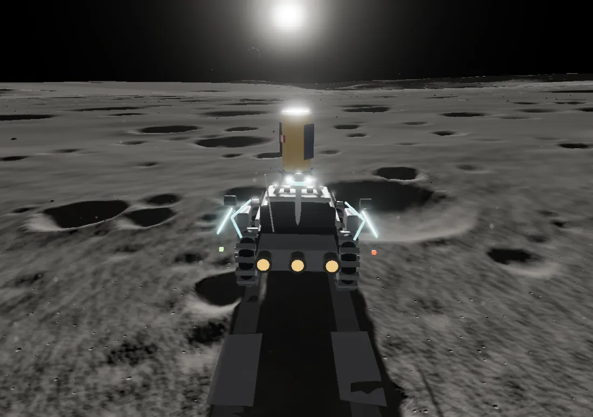<br>
  <sub>IM-1 Odysseus, resting on its side near the south pole, as it did in 2024</sub>
</p>

## The mission

- **Launch on time.** The window is solved from real orbital mechanics: leave early or late and you arrive in the wrong place. Wait for the green band, or skip the wait.
- **Fly the ascent by hand.** Straight up wastes everything — orbit is sideways speed. Pitch over into a gravity turn until apoapsis reaches 100 km, then coast.
- **Rendezvous and dock.** Attitude aids (HOLD, DOCK, MATCH, PROGRADE, RETRO) and an RCS cue help you fly it. Come in hard or off-axis and you wreck both ships.
- **Land again.** The descent mission starts at powered-descent initiation, 15 km up with 1.7 km/s still to kill. Brake toward the *surface's* velocity, not zero: the ground moves.
- **Then explore.** Drive the buggy, jump it, roll it, and visit the hardware humanity has left on the Moon.

## The buggy

Real low-gravity physics, not arcade feel. Braking is friction-limited, so stops are long and slidey. Over a rise of radius R the wheels leave the ground at **v = √(g·R)** — a sharp crater rim at about 5 m/s, a cliff edge at any speed. Hard cornering rolls it, because lunar gravity makes the tip limit low. Airborne it becomes a vacuum rocket flyer. Top speed about 200 km/h, and well past 400 km/h on turbo.

## Controls

**Flying.** Arrow keys throttle, Space cuts it. `I/K` pitch, `J/L` yaw, `U/O` roll. `W/S A/D R/F` fire the RCS thrusters. `Q` HOLD, `E` DOCK, `G` MATCH, `R` RETRO. `V/N/B/C` switch cameras, drag to look, wheel to zoom.

**Driving.** `W` accelerate, `S` brake and reverse, `A/D` steer, `Shift` turbo. Once airborne the same keys fly it: `W/S` forward and retro thrust, `A/D` turn and bank, `R` climb, `F` descend. Drag to orbit the camera.

**Everywhere.** `[` and `]` set time acceleration (up to 1000×), `M` cycles the map, `L` labels, `P` sound, `?` opens the full flight manual.

**Phone.** A thumb-stick, a throttle slider and a six-button RCS pad that matches the on-screen cue; driving swaps in a TURBO button. Tap **TILT** to steer by tilting the phone.

## What's real, and what isn't

The world is built from published data and physics; the hardware and the peril are dramatised.

**Real**

- **Sky.** The Sun, Earth and stars sit at their true positions for the mission epoch (astronomy-engine, checked against JPL Horizons). Earth shows the correct phase and lights the night side with earthshine.
- **Terrain.** Hadley is built from NASA SLDEM2015 and LOLA elevation data at its real coordinates, with procedural craters and regolith close up. Apollo 15's lander and relics sit at their published positions, and the clipmap re-anchors as you roam, so the whole globe is drivable.
- **Orbital mechanics.** The launch-window solution, the ascent, the rendezvous (Clohessy–Wiltshire relative motion), the powered descent and the docking contact model are all physically simulated at float64 precision.
- **Mission sites.** Every spacecraft in the table sits at its published landing or impact coordinates.
- **Light.** Physically-based exposure with no air to soften shadows. The far side really is dark when the Sun is down.

**Dramatised**

- **The KESTREL ascent stage, the mothership ARGO and the crew buggy** are fictional vehicles. KESTREL carries more propellant than a real Apollo ascent stage so a wasted burn can genuinely reach escape.
- **Mission models** are recognisable approximations at correct scale, not engineering reconstructions; the national flags are drawn from their published geometric descriptions.
- **Destruction** is styled for vacuum (no fire, freezing vapour, ballistic debris), not engineering-accurate.
- **Timescales** are compressed so a rendezvous takes minutes, not hours.

## Run it locally

```bash
bun install
bun run dev      # http://127.0.0.1:5181
bun test         # unit tests
bun run build    # production build into dist/
```

Deploys to GitHub Pages automatically on every push to `main`.

## Credits

Data sources and their licences are listed in [`public/CREDITS.md`](public/CREDITS.md). Built with [three.js](https://threejs.org), [Vite](https://vite.dev), [astronomy-engine](https://github.com/cosinekitty/astronomy) and [Bun](https://bun.sh); spacecraft, relics and mission models built in [Blender](https://www.blender.org) (scripts in `tools/blender`).
