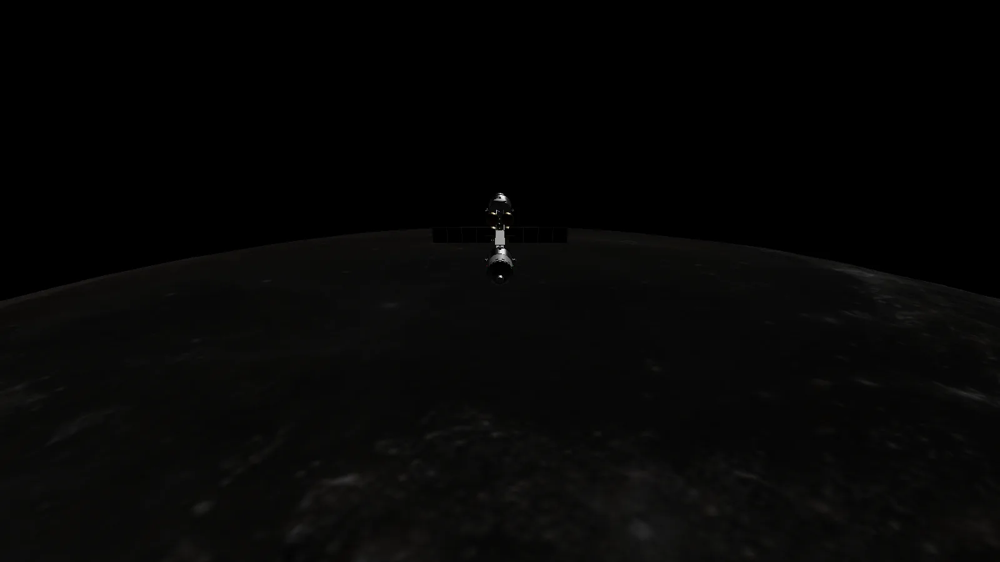
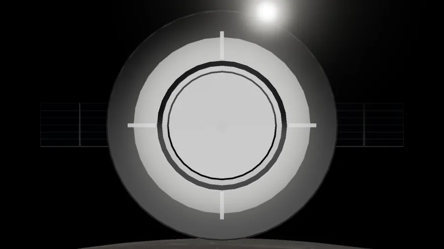

# LAST WINDOW · Moon ascent

<p align="center">
  <a href="https://farikonsec.github.io/last-window/"></a>
</p>

<p align="center"><b><a href="https://farikonsec.github.io/last-window/">▶ Play in your browser</a></b> · desktop, iPhone and Android · no install</p>

<table>
  <tr>
    <td width="33%"><br><sub>On the pad at Hadley, waiting for the window</sub></td>
    <td width="33%"><br><sub>Manual ascent off the surface</sub></td>
    <td width="33%"><br><sub>Final approach to ARGO's port</sub></td>
  </tr>
</table>

You have one launch window. Lift the KESTREL ascent stage off the Moon near Apollo 15's landing site at Hadley, fly a manual ascent into a 100 km orbit, catch the mothership ARGO and dock by hand before your propellant runs out.

It runs entirely in the browser (WebGL, no backend). A desktop browser with a GPU works best; phones work too.

## The mission

- **Launch on time.** The window is solved from real orbital mechanics: leave early or late and you arrive in the wrong place, where ARGO can hit you. Wait for the green band.
- **Fly the ascent by hand.** Too slow and you fall back to the surface; too fast and you escape the Moon entirely. Follow the pitch cue until apoapsis reaches 100 km, then coast.
- **Rendezvous and dock.** Match ARGO's velocity, line up on the docking port and close gently. Attitude aids (HOLD, DOCK, MATCH, PROGRADE) and an RCS cue help you fly it. Come in hard or off-axis and you wreck both ships.
- **Get scored.** A clean dock is graded gold, silver or bronze on contact speed, alignment, propellant spent and time. Your best is kept between runs.

## Controls

**Desktop.** Arrow keys throttle the main engine, Space cuts it. `I/K` pitch, `J/L` yaw, `U/O` roll. `W/S A/D R/F` fire the RCS translation thrusters. `Q` HOLD, `E` DOCK, `G` MATCH. `V/N/B/C` switch cameras, drag to look, wheel to zoom. `P` toggles sound.

**Phone.** A rotation stick, a throttle slider and a six-button RCS pad that matches the on-screen cue. Tap **TILT** to steer by tilting the phone — the pose you hold when you tap becomes centre, long-press to re-centre.

## What's real, and what isn't

The world is built from published data and physics; the hardware and the peril are dramatised.

**Real**

- **Sky.** The Sun, Earth and stars sit at their true positions for the mission epoch (astronomy-engine, checked against JPL Horizons). Earth shows the correct phase and lights the night side with earthshine.
- **Terrain.** Hadley is built from NASA SLDEM2015 and LOLA elevation data at its real coordinates, with procedural craters and regolith close up. Apollo 15's lander and relics sit at their published positions.
- **Orbital mechanics.** The launch-window solution, the ascent, the rendezvous (Clohessy–Wiltshire relative motion) and the docking contact model are all physically simulated at float64 precision.
- **Light.** Physically-based exposure with no air to soften shadows, as on the real Moon.

**Dramatised**

- **The KESTREL ascent stage and the mothership ARGO** are fictional, LM-inspired vehicles. KESTREL carries more propellant than a real Apollo ascent stage so a wasted burn can genuinely reach escape.
- **Destruction.** A bad dock vents cabin atmosphere and breaks the ships apart. It is styled for the vacuum (no fire, freezing vapour, ballistic debris), not engineering-accurate.
- **Timescales** are compressed so a rendezvous takes minutes, not hours.

## Run it locally

```bash
bun install
bun run dev      # http://127.0.0.1:5181
bun test         # unit tests
bun run build    # production build into dist/
```

Deploys to GitHub Pages automatically on every push to `main`.

## Credits

Data sources and their licences are listed in [`public/CREDITS.md`](public/CREDITS.md). Built with [three.js](https://threejs.org), [Vite](https://vite.dev), [astronomy-engine](https://github.com/cosinekitty/astronomy) and [Bun](https://bun.sh); spacecraft and relics modelled in [Blender](https://www.blender.org) (scripts in `tools/blender`).
